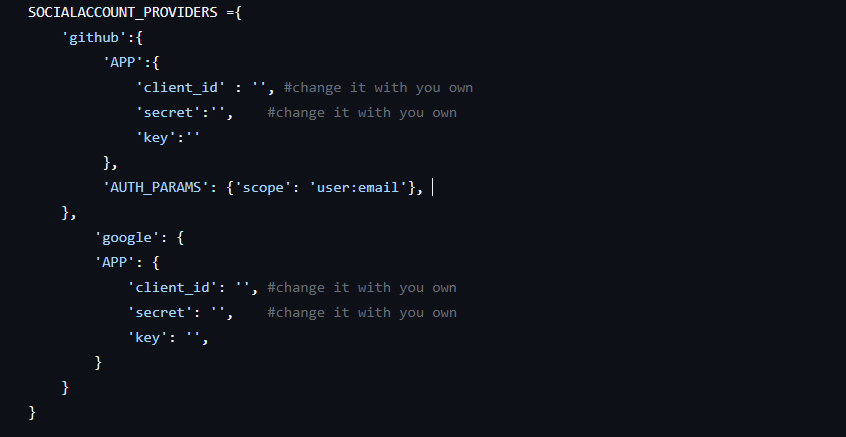

# Quiz Portal
Quiz Portal is a web-based platform that allows users to create, participate in, and manage quizzes. The platform supports both public and private quizzes, user authentication, and real-time score tracking. This project is built with Django and includes features such as quiz creation, question management, and password-protected private quizzes.

# Features
- User Authentication:
  - Secure login and signup system.
  - The system ensures secure registrations by sending a verification link to the user's email.
- Signup via Social Account:
  - Users can easily sign up and log in using their social media accounts for a seamless experience.
- User Profile: Users can view their stats, personal information, and manage profile settings.
- Quiz Creation:
  - Users can create and host both public and private quizzes for diverse audiences.
  - Password protection for private quizzes.
- Quiz Participation:
  - Filter quizzes by tags, type, or availability.
  - Users can participate in both public and private quizzes based on their access level.
- Blog: A platform to create and share blogs related to quizzes, enhancing engagement and learning.
- Feedback: After completing a quiz, users can provide feedback to improve the quiz quality and platform.
- Leaderboard: Displays the ranking of quiz participants to encourage competition and celebrate top scorers.
- Chatbox: A real-time messaging feature that allows users to communicate and collaborate with each other.

  # Installation
  ### Prerequisites
  - Python (3.8 or later)
  - pip
  - Git

  ### Steps
  1. Clone the Repository
     ```py
     git clone https://github.com/almahfuz777/Quiz-Portal.git
     ```
  2. Set Up a Virtual Environment (optional)
     ```py
     python -m venv .venv
     source .venv/bin/activate  # For Linux/Mac
     .venv\Scripts\activate     # For Windows     .venv\
     ```
  3. Install Dependencies
      ```py
      pip install -r requirements.txt
      ```
      
  4. Update the settings.py in Quiz_Portal with your own app's client_id, secret
     
      
      
      .png "Quiz Portal settings.py")
     
  5. Run Database Migrations
      ```py
      python manage.py migrate
      ```
  6. Start Development Server
      ```py
      python manage.py runserver
      ```
      
# Technologies Used
- Backend: Django (Python-based web framework for rapid development)
- Frontend: HTML, CSS, JavaScript (used for UI and interactivity)
- Database: SQLite (lightweight database included with Django by default)
- Documentation: Sphinx (used for generating project documentation)
- Testing: Django's built-in testing framework (ensures application reliability and correctness)
- Coding Standard: pep8
  
# Project Structure
```txt
Quiz-Portal/
├── Quiz_Portal/             # Project's main directory (contains settings and configurations)
│   ├── migrations/          # Auto-generated files for database schema changes
│   ├── settings.py          # Django project settings (configuration for the entire project)
│   ├── tests.py             # Test cases to ensure the app's functionality
│   ├── urls.py              # URL routing for the project
│   ├── models.py            # Defines the database models for the app
│   └── urls.py              # App-specific URL routing (duplicate entry in original, can be omitted or adjusted)
├── other_apps/              # Additional apps within the project
├── static/                  # Static assets (CSS, JavaScript, images)
├── templates/               # HTML templates used to render views
├── manage.py                # Django's command-line utility for administrative tasks
├── requirements.txt         # List of Python dependencies for the project
├── db.sqlite3               # SQLite database file (default database for Django projects)
└── README.md                # Documentation for the project
```

# Contributing
We welcome contributions to this project! To contribute:

- Fork the repository.
- Create a new branch for your feature or bugfix.
- Commit your changes and push to your forked repository.
- Open a pull request with a clear description of your changes.

<hr>
Happy quizzing! 🎉
